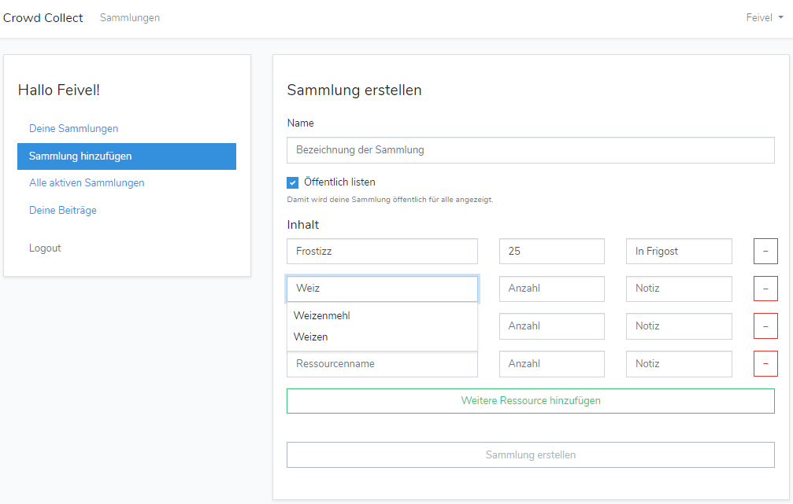
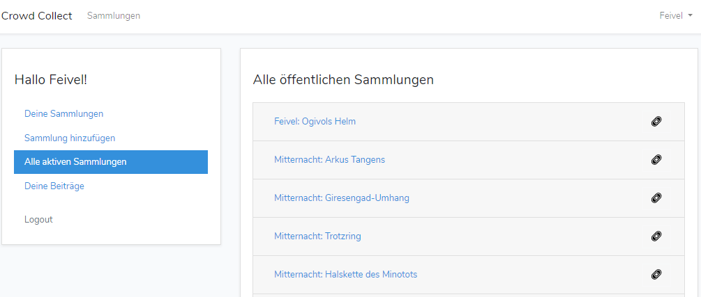
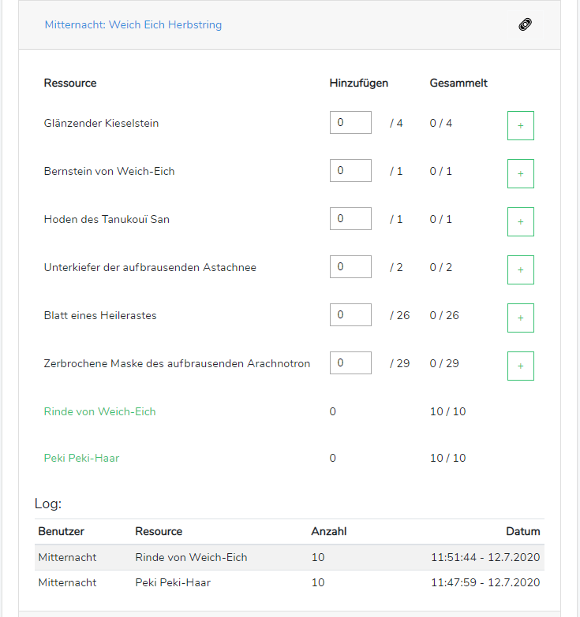

# Dofus Crowd Collect
A simple tool to collect resources together.







# Installation
Use docker.

```shell script
$ git clone https://github.com/octfx/dofus-crowd-collect.git
$ cd dofus-crowd-collect
$ docker-build -t dofus-cc .
$ # ensure the db is writable
$ touch database.sqlite
$ touch env
```

Add this to your env file (and update the url):
```
APP_NAME=Dofus Crowd Collect
APP_ENV=production
APP_KEY=
APP_URL=http://your-url

LOG_CHANNEL=daily

DB_CONNECTION=sqlite

BROADCAST_DRIVER=log
CACHE_DRIVER=file
QUEUE_CONNECTION=sync
SESSION_DRIVER=file
SESSION_LIFETIME=120
```

```shell script
$ docker-compose up -d
$ docker exec -it dofus-cc /bin/bash
$ php artisan key:generate
$ php artisan migrate
$ php artisan import:resources
```

All set.
